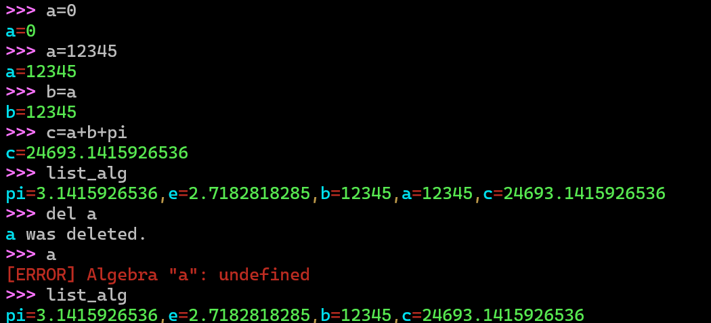
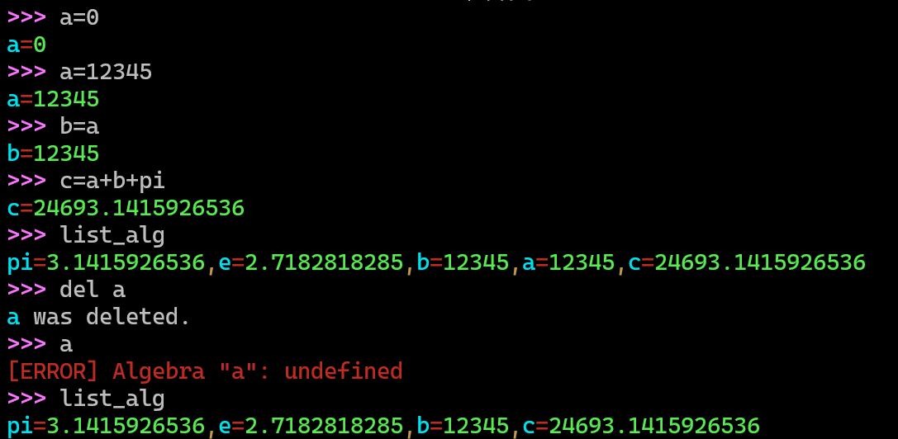
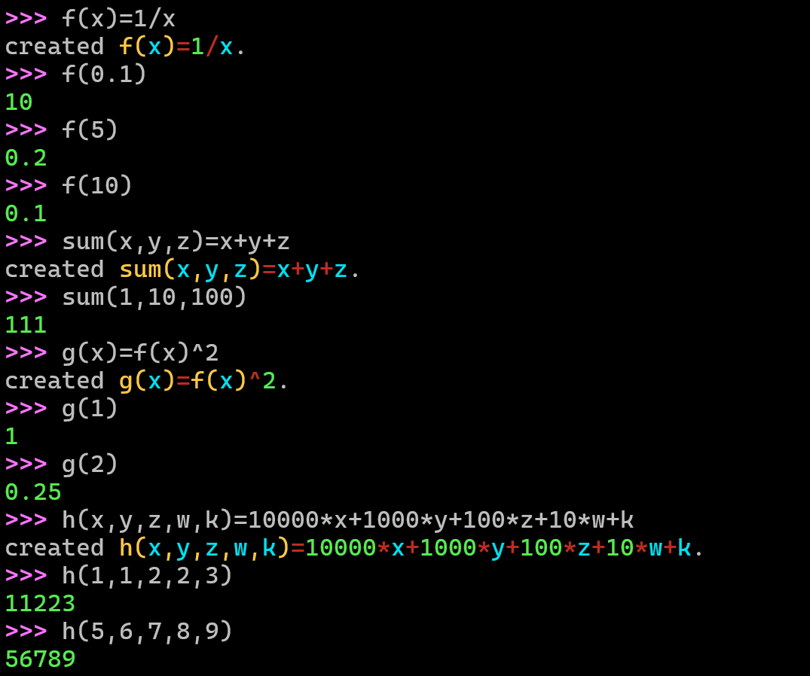
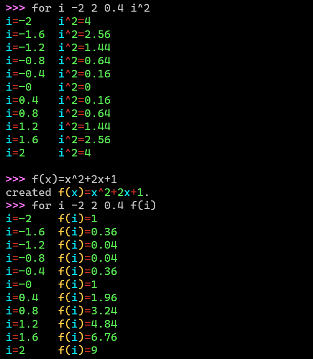
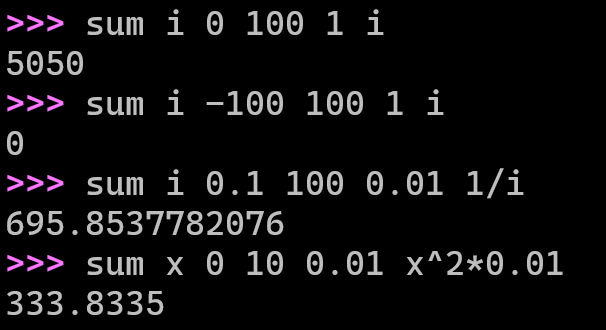

# 表达式计算器 Expression-Calculation
## 介绍
在控制台运作的表达式计算器 并且支持条件表达式 定义函数 函数求值 定义变量 高亮显示 求和 循环 等功能。
 This is an expression calculator that supports conditional expressions, user‑defined functions, variable definitions, syntax highlighting, summation, loops, and other features.
## 使用
1.`help` 帮助 
2.直接输入表达式 将返回计算结果 
3.`x=1+2+3` 设置或者创建一个变量x 
4.`x` 将返回`x`的值 
5.`f(x)`将返回函数值 
6.`f(x)=x^2+2x+1` 将设置一个函数 
7.`f()` 返回函数f的定义(参数和表达式) 
8.`del f()`将删除一个函数 
9.`del a`将删除一个变量 
10.`list_func`将列出所有已经有的函数和运算符 
11.`list_alg`将列出所有的变量 
12.`list`将列出所有已经有的函数和运算符和变量 
13.`for <i> <begin> <end> <step> <expr>` 
循环:  `i`表示迭代变量 `step`表示步长 `expr`表示表达式 `i`在`[begin, end]`区间迭代 并输出每次迭代的结果 
14.`sum <i> <begin> <end> <step> <expr> [out]` 
求和 : `i`表示迭代变量 `step`表示步长 `expr`表示表达式 `i`在`[begin, end]`区间迭代 并输出表达式之和 `out`可选可不选 表示输出到哪个变量 
15.`rename <old_name> <new_name>` 重命名变量 
## 效果
 表达式计算

  

变量的操作 

  

 函数的使用

  

 循环

  

 求和

  

